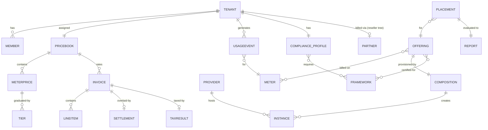

# Canonical Entities & Relations

The model reuses established open-source cloud meta-models rather than inventing
one:

- **Identity/tenancy** mirrors **OpenStack Keystone** (Domain → Project → User /
  Role) — our `Tenant` ≈ Project, `Member`+`Profile` ≈ User+Role.
- **Provisioning** mirrors the **Open Application Model (OAM)** / Crossplane
  (Component → Composition → Managed Resource) — our `Offering` ≈ Component,
  `Composition` ≈ OAM workload, `Instance` ≈ Managed Resource.
- **Billing** mirrors the **FinOps FOCUS** spec (Usage → Pricing → Billed Cost)
  — our `UsageEvent` ≈ FOCUS usage, `PriceBook` ≈ pricing, `Invoice` ≈ billed
  cost. (See FOCUS: finops.org/focus.)

## Entities

| Entity | Package | Key fields | Reference model |
|--------|---------|-----------|-----------------|
| Tenant | `tenant` | id, name, priceBook | Keystone Project |
| Member | `tenant` | subject, profile | Keystone User+Role |
| Provider | `provider` | name | Cluster API / OpenStack region |
| Offering | `catalog` | id, project, category, composition, meters, certifications, publisher | OAM Component |
| Instance | `provider` | id, provider, kind, status | Crossplane Managed Resource |
| UsageEvent | `metering` | tenantId, meter, quantity, at | FOCUS usage record |
| PriceBook / MeterPrice / Tier | `billing` | version, allowance, tiers | FOCUS pricing |
| Invoice / LineItem | `billing` | tenantId, lines, total | FOCUS billed cost |
| Partner / Settlement | `billing` | mode, rate | reseller/marketplace overlay |
| TaxRule / TaxResult | `billing` | jurisdiction, rate | tax jurisdiction |
| Framework (Spec) | `compliance` | framework, category, regions | control catalog |
| Compliance Profile | `compliance` | tenantId, frameworks, dataResidency, jurisdiction | tenant posture |
| Placement / Report | `compliance` | region, certifications | policy decision |

## Relations (ER)

`TenantID` is the single join key across tenancy, identity, usage, billing, and
compliance (ADR-0002), keeping the model composable and correlation trivial.
