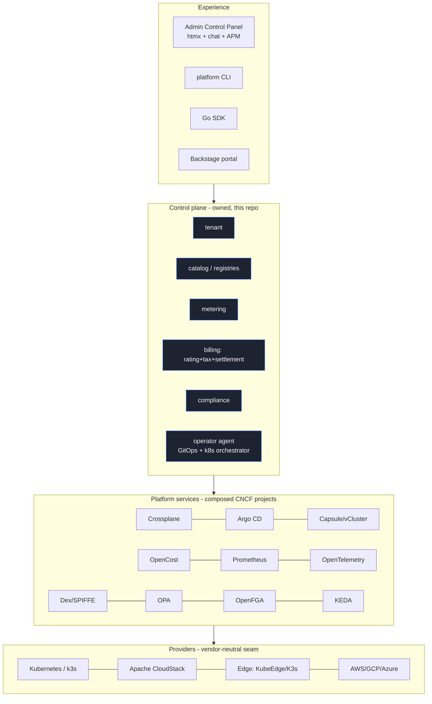

# Stack, Artifacts & Runtimes

## Where everything fits

## Artifacts (all OCI-standard, transportable)

| Artifact | Produced by | Consumed by | Notes |
|----------|-------------|-------------|-------|
| Service OCI images | `Dockerfile` (static/scratch) | any OCI runtime / k8s | runs on any cloud |
| Helm chart | `deploy/helm/platform` | Helm / Argo CD | vanilla, no cloud assumptions |
| **Datasets** (offerings, pricebook, tax, frameworks) | `deploy/datasets/*.json` | services at deploy via ConfigMap | versioned data, not code |
| Plugins/extensions | `plugins/*` | binaries (blank import) | native-runtime, compile-time |
| Sandbox manifest | `deploy/sandbox/pod.yaml` | podman / k8s | phase-by-phase testing |
| OTLP traces | `internal/observe` | Jaeger/Tempo/Prometheus | exported for BI/insights |
| SBOM / provenance | CI (see `docs/versioning.md`) | supply-chain tooling | lineage |

## Runtimes (users can target any)

| Runtime | How | Where it fits |
|---------|-----|---------------|
| Local binaries | `make build` | Phase 1 dev |
| Podman pod | `make sandbox-up` | Phase 3 sandbox |
| Single-node **k3s** | `helm install` (see `docs/deploy-k3s.md`) | edge / small prod, managed via **Headlamp** + k3s API |
| Multi-node Kubernetes | Helm + Argo CD | full prod |
| Apache CloudStack VMs | `provider=cloudstack` | legacy/VM estates (optional, ADR-0004) |
| Edge (KubeEdge/K3s) | `provider=edge` | edge sites |

All services are **headless / API-first**; the admin panel is an optional,
separable UI over the same APIs the SDK and CLI use.
